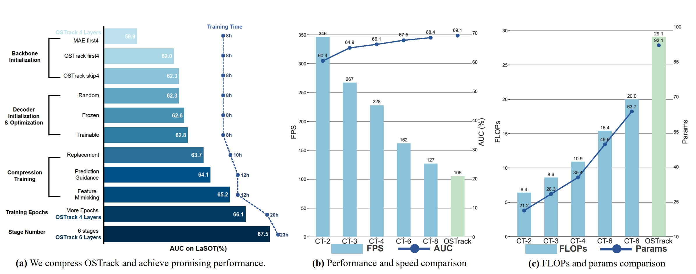
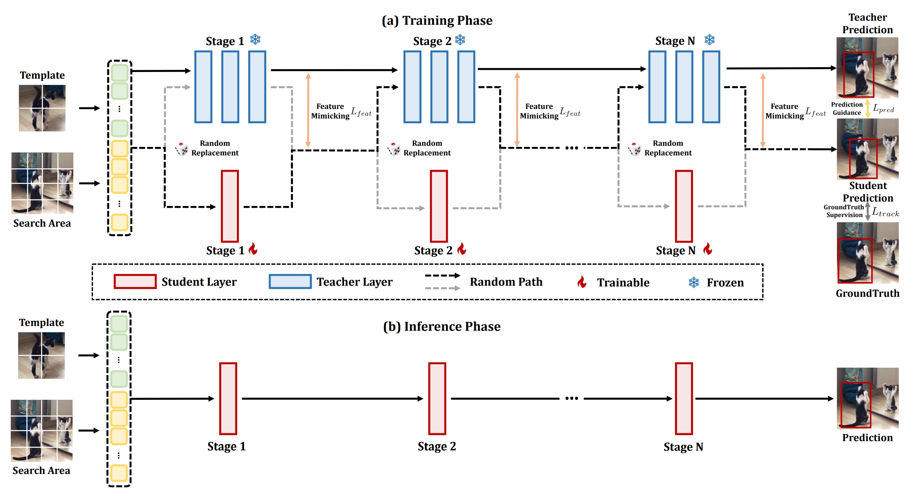

# CompressTracker
The official implementation for the CompressTracker [_General Compression Framework for Efficient Transformer Object Tracking_](https://arxiv.org/abs/2409.17564v1).

<!-- [[Models]()][[Raw Results]()][[Training logs]()] -->
[[Models](https://drive.google.com/drive/folders/1qsl9KPDC6zxnjel1EFvoW_qA6lE2Pep6?usp=sharing)]


# High Efficiency

<p align="center">
  
</p>

# Compression Framework

<p align="center">
  
</p>

## News
**[Oct. 16, 2024]**
- Code is available now!

**[Oct. 28, 2022]**
- We released our CompressTracker.


## Highlights

### :star2: General and High Efficient Compression Framework
Our CompressTracker can be applied to any transformer tracking models. Moreover, CompressTracker supports any arbitrary levels of compression.

| Tracker     | GOT-10K (AO) | LaSOT (AUC) | TrackingNet (AUC) | UAV123(AUC) |
|:-----------:|:------------:|:-----------:|:-----------------:|:-----------:|
| OSTrack-384 | 73.7         | 71.1        | 83.9              | 70.7        |
| OSTrack-256 | 71.0         | 69.1        | 83.1              | 68.3        |


### :star2: End-to-end and Simple Training
Our CompressTracker only needs an end-to-end and simple training instead of multi-stage distillation in [MixFormerV2](https://arxiv.org/abs/2305.15896). The training cost is much lower than MixFormerV2.

### :star2: Better Trade-off Between Accuracy and Speed
Our compressTracker achieves better trade-off between performance and speed.


## Install the environment
**Option1**: Use the Anaconda (CUDA 11.7)
```
conda create -n compresstracker python=3.9
conda activate compresstracker
bash install.sh
```

**Option2**: Use the Anaconda (CUDA 11.7)
```
conda env create -f compresstracker_env.yaml
```


## Set project paths
Run the following command to set paths for this project
```
python tracking/create_default_local_file.py --workspace_dir . --data_dir ./data --save_dir ./output
```
After running this command, you can also modify paths by editing these two files
```
lib/train/admin/local.py  # paths about training
lib/test/evaluation/local.py  # paths about testing
```

## Data Preparation
Put the tracking datasets in ./data. It should look like this:
   ```
   ${PROJECT_ROOT}
    -- data
        -- lasot
            |-- airplane
            |-- basketball
            |-- bear
            ...
        -- got10k
            |-- test
            |-- train
            |-- val
        -- coco
            |-- annotations
            |-- images
        -- trackingnet
            |-- TRAIN_0
            |-- TRAIN_1
            ...
            |-- TRAIN_11
            |-- TEST
   ```


## Training
Download pre-trained [MAE ViT-Base weights](https://dl.fbaipublicfiles.com/mae/pretrain/mae_pretrain_vit_base.pth) and put it under `$PROJECT_ROOT$/pretrained_models`. Besides, please download the pretrained [OSTrack weights](https://drive.google.com/file/d/1lpmc5DhZTIluKdvawvt-5iOpLZtcRjm4/view?usp=drive_link) and put it under `$PROJECT_ROOT$/pretrained_models`, too.

```
python tracking/train.py --script compresstracker --config compresstracker_vitb_256_4 --save_dir ./output --mode multiple --nproc_per_node 8
```

Replace `--config` with the desired model config under `experiments/compresstracker`.

It is worth noting that our CompressTracker can support any structure, any resolution, and any level of compression. We provide the code for *CompressTracker-2/3/4/6* in our paper, and you can easily modify it to compress your own model.


## Evaluation
Download the model weights from [Google Drive](https://drive.google.com/file/d/1DBZzSBUdRLke975Gc9A8Cmyx4vBBL6O6/view?usp=sharing) 

Put the downloaded weights on `$PROJECT_ROOT$/output/checkpoints/train/compresstracker`

Change the corresponding values of `lib/test/evaluation/local.py` to the actual benchmark saving paths

Some testing examples:
- LaSOT or other off-line evaluated benchmarks (modify `--dataset` correspondingly)
```
python tracking/test.py compresstracker compresstracker_vitb_256_4 --dataset lasot --threads 64 --num_gpus 8
python tracking/analysis_results.py # need to modify tracker configs and names
```
- TrackingNet
```
python tracking/test.py compresstracker compresstracker_vitb_256_4 --dataset trackingnet --threads 64 --num_gpus 8
python lib/test/utils/transform_trackingnet.py --tracker_name compresstracker --cfg_name compresstracker_vitb_256_4
```


## Test FLOPs, and Speed
*Note:* The speeds reported in our paper were tested on a single RTX2080Ti GPU.

```
# Profiling vitb_256_mae_ce_32x4_ep300
python tracking/profile_model.py --script compresstracker --config compresstracker_vitb_256_4
```


## Acknowledgments
* Thanks for the [OSTrack](https://github.com/botaoye/OSTrack?tab=readme-ov-file), [PyTracking](https://github.com/visionml/pytracking) library, [MixFormerV2](https://github.com/MCG-NJU/MixFormerV2/?tab=readme-ov-file), and [OneTracker](https://arxiv.org/abs/2403.09634), which helps us to quickly implement our ideas.
* We use the implementation of the ViT from the [Timm](https://github.com/rwightman/pytorch-image-models) repo.  


## Citation
If our work is useful for your research, please consider citing:

```Bibtex
@article{hong2024general,
  title={General Compression Framework for Efficient Transformer Object Tracking},
  author={Hong, Lingyi and Li, Jinglun and Zhou, Xinyu and Yan, Shilin and Guo, Pinxue and Jiang, Kaixun and Chen, Zhaoyu and Gao, Shuyong and Zhang, Wei and Lu, Hong and others},
  journal={arXiv preprint arXiv:2409.17564},
  year={2024}
}
```
